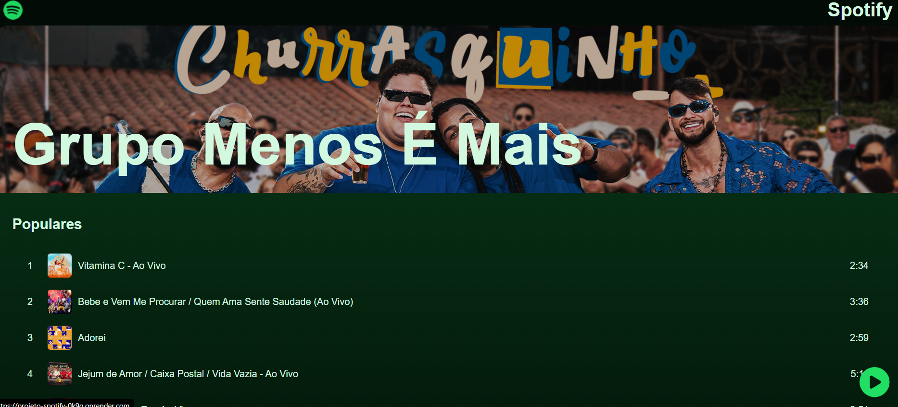

# Projeto Réplica Spotify

## Descrição geral
Durante o desenvolvimento deste projeto, tive a oportunidade de construir uma réplica do aplicativo Spotify ao longo de quatro aulas da escola Hashtag Treinamentos. Esse foi um desafio extremamente enriquecedor, pois representou meu primeiro contato com tecnologias como React, MongoDB e integração com APIs, além de me proporcionar experiência com diversas práticas essenciais de desenvolvimento.

O projeto foi iniciado utilizando o Vite, uma ferramenta que agiliza o processo de desenvolvimento ao oferecer um ambiente mais rápido para a criação de aplicações React. Em seguida, foi implementado o React para estruturar e desenvolver as cinco páginas principais: Home, Artistas, Artista, Músicas e Música. Além das páginas, diversos componentes foram criados para garantir uma navegação intuitiva, como a barra de navegação presente em todas as telas, listas dinâmicas de músicas e artistas, entre outros.

Para a lógica por trás das interações, utilizamos Node.js, permitindo a implementação de funcionalidades como o botão "Ver Mais" na seção de artistas e músicas, que inicialmente exibe apenas cinco itens e, ao ser acionado, expande a lista para dez. Também foi desenvolvida a lógica do player de música, que controla a reprodução, permitindo play, pause, avanço e retrocesso entre as faixas.

No back-end, utilizamos MongoDB para armazenar os dados dos artistas e músicas. As informações registradas incluíam nome, imagem, banner para a página do artista, detalhes das músicas como título, duração, capa e o arquivo de áudio. Esses dados foram disponibilizados por meio de uma API, integrando o front-end ao back-end de maneira eficiente. Para hospedar a aplicação, utilizamos a plataforma Render, garantindo que o sistema pudesse ser acessado online.

Este projeto foi uma experiência incrível de aprendizado. Foi meu primeiro contato prático com diversas tecnologias modernas, e pude compreender de forma aprofundada conceitos fundamentais do desenvolvimento web full-stack. A experiência também reforçou minha habilidade de trabalhar com APIs, manipular banco de dados NoSQL e construir interfaces dinâmicas e responsivas utilizando React. Sem dúvidas, esse projeto representou um grande salto na minha evolução como desenvolvedor.

## Tecnologias usadas:

## Resultados
https://projeto-spotify-0k9g.onrender.com/

